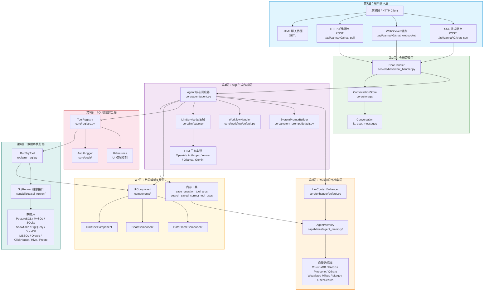
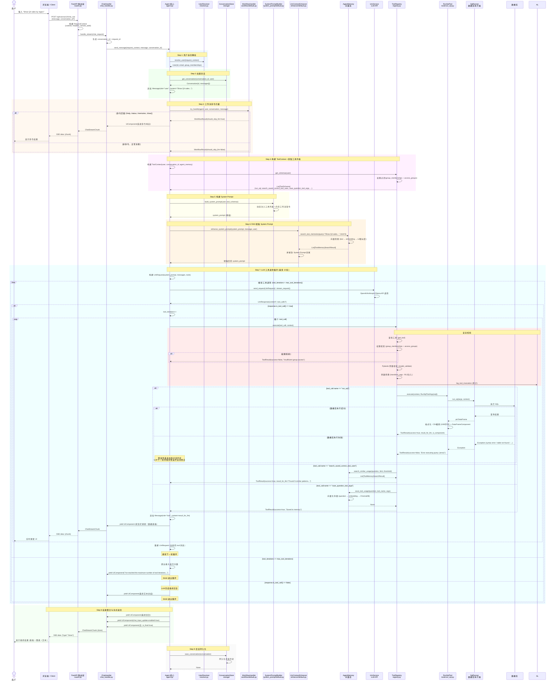
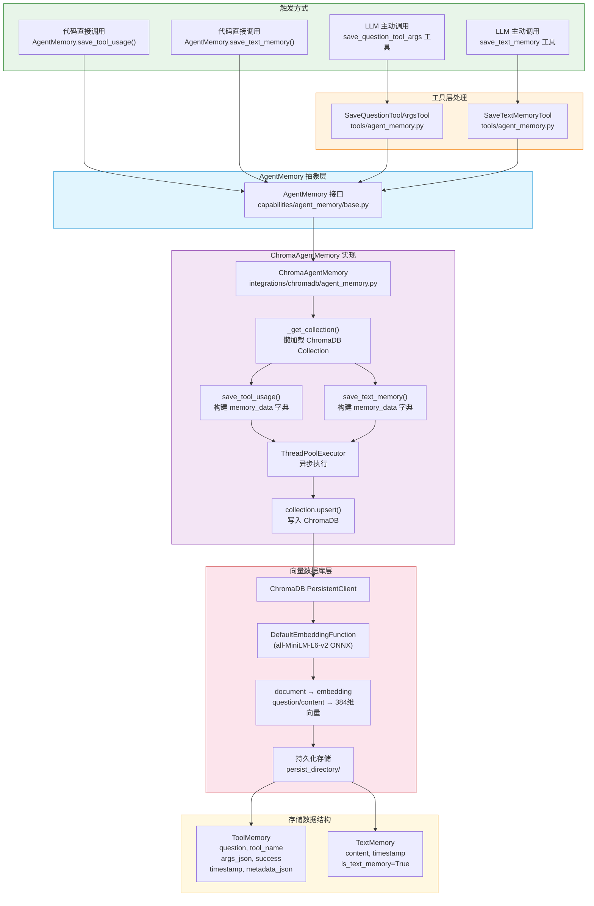
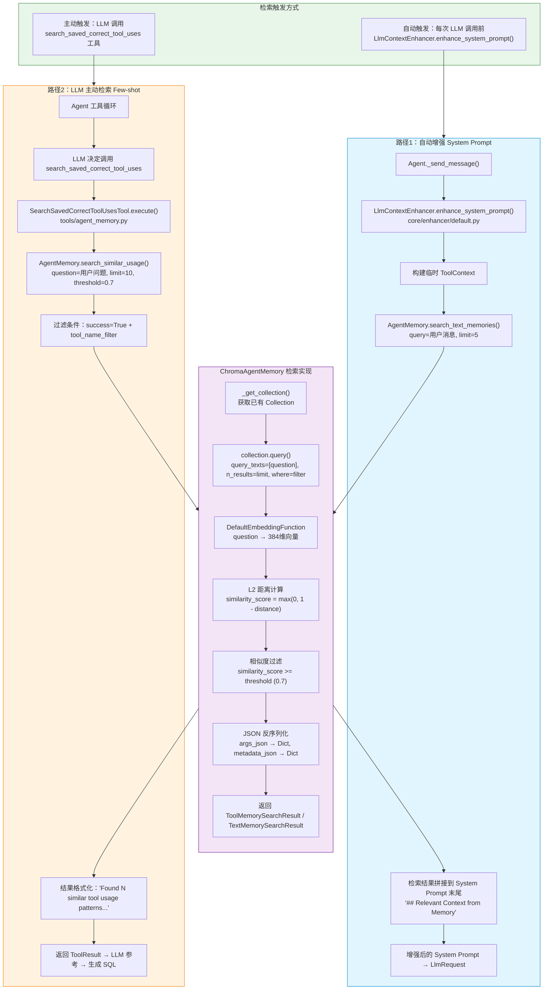
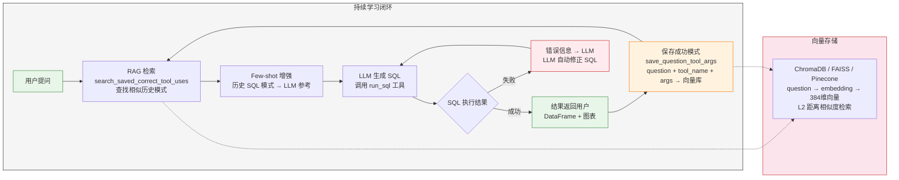
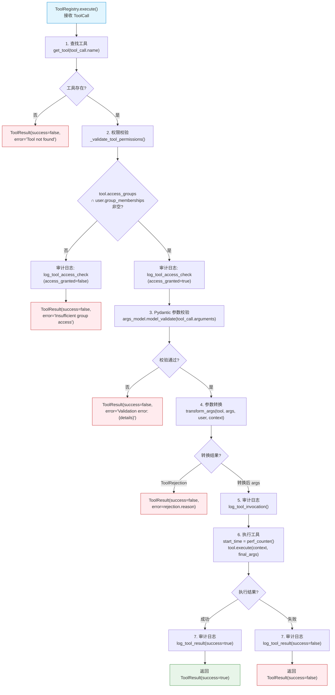
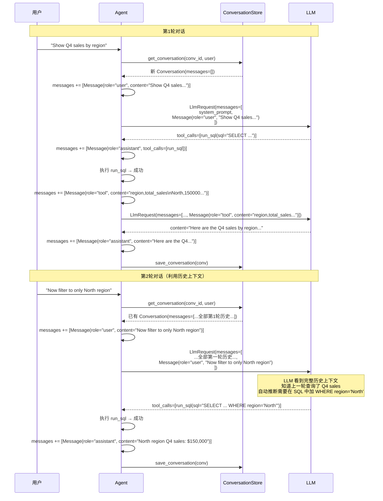

# Vanna AI 源码深度解析文档

## 6. Mermaid可视化流程图

本章输出三类可直接渲染的 Mermaid 图表，覆盖系统架构、业务时序、RAG 知识库全流程。

---

### 6.1 整体系统架构分层图

---

### 6.2 自然语言转SQL完整业务时序流程图

**含正常流程 + 异常纠错分支**

---

### 6.3 RAG知识库构建与检索流程图

#### 6.3.1 知识库构建流程（Save）

#### 6.3.2 知识库检索流程（Search）

#### 6.3.3 持续学习闭环（完整生命周期）

---

### 6.4 补充：工具权限校验流程图

---

### 6.5 补充：多轮对话完整上下文管理流程

